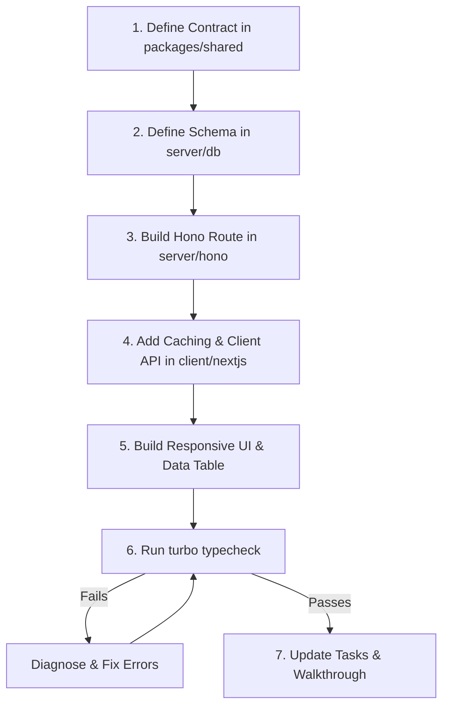

# Thunder Stack Universal Engineering & Architecture Blueprint

Thunder Stack is an ultra-performant, production-hardened, multi-cloud monorepo template engineered for cross-platform full-stack applications powered by Next.js 15+ (React 19), Hono (Cloudflare Workers & Edge), Drizzle ORM, Better Auth, Expo 54 (React Native), and Python-driven ML/Deep Learning pipelines.

---

## 1. Golden User Rules & Pair-Programming Expectations

### A. Terminal Command Minimization
- **Minimize command execution:** Avoid running repetitive shell exploratory commands (`dir`, `ls`, `cat`, `Get-ChildItem`). Read and analyze local workspace files directly using built-in read and search tools.
- **Suggest in Walkthrough:** Provide clear, copy-pasteable terminal commands in the final walkthrough or response whenever the user can or prefers to execute operations themselves (e.g., long-running dev servers, database migrations, package installations, npm publishing).

### B. Pre-Commit Quality & Husky Checks
- **Typecheck before commit:** Always verify TypeScript integrity before committing (`pnpm typecheck` or `turbo run typecheck` across all affected workspaces).
- **Husky & Hook Verification:** Ensure pre-commit and husky linters will pass cleanly without manual bypasses (`--no-verify` is strictly forbidden). If a type error or lint issue surfaces, fix it immediately prior to staging and committing.

### C. Git Workflow & Commit Convention
- **No rebase and no force-push:** Never run `git rebase` or `git push --force`. Always use standard `git pull origin <branch>` and standard `git push origin <branch>` to prevent team history disruption.
- **Conventional Commits:** Write concise, lowercase, imperative, single-line commit messages adhering to repository history:
  ```text
  <type>(<scope>): <what changed, imperative, lowercase>
  ```
  *Allowed Types:* `feat`, `fix`, `refac`, `chore`, `docs`, `style`, `data`, `ml`, `exp`  
  *Allowed Scopes:* `web`, `api`, `db`, `ml`, `data`, `auth`, `config`, `table`  
  *Good Examples:*
  - `feat(web): add global app context, table filtering, and runtime domain fallback`
  - `fix(db): resolve aiven postgres custom ca ssl handshake`
  - `chore(deploy): separate cloudflare ci build and deploy commands`
- **Forbidden Commit Practices:** Never attach promotional trailers, AI watermarks, changelog essays, or `Co-Authored-By` signatures. Keep commits clean and atomic.

### D. Data Privacy & Confidentiality (PHI / PII Safeguard)
- Never stage or commit raw datasets, medical imaging (DICOM, NIfTI, NRRD, `.seg.nrrd`), or confidential customer archives.
- Never paste patient or confidential identifiers into commit messages, chat, or documentation. Use pseudonymous identifiers (e.g., `CASE-001`, `USER-DEV-01`).
- Avoid indiscriminate `git add .` or `git add -A`. Explicitly stage individual modified files: `git add path/to/file.tsx`.

---

## 2. Monorepo Architecture & Modular Structuring

```text
├── client/
│   ├── nextjs/            # Next.js 15+ (App Router, React 19, Tailwind CSS v4, Lucide icons)
│   └── expo/              # React Native / Expo 54 cross-platform mobile client
├── server/
│   ├── hono/              # Hono API Gateway (Cloudflare Workers / Edge / Node server)
│   └── db/                # @thunder/db: Drizzle ORM schemas, migrations, seeds, Supabase/Aiven
├── packages/
│   ├── shared/            # Shared TypeScript types, Zod DTO schemas, API contracts
│   └── create-thunder-app/# npx create-thunder-stack CLI scaffolding engine
├── ml/                    # Python ML workspace (PyTorch, torchvision, FastAPI, pipeline scripts)
├── scripts/               # Environment setup, database dev lifecycle scripts
├── turbo.json             # Turborepo task pipeline (topological build, dev, typecheck)
└── package.json           # Root pnpm monorepo workspace definition
```

### A. Clean Layer Boundaries & Directory Hygiene
1. **Contract First (`packages/shared`):**
   - All request/response schemas, shared interfaces, and enum types reside in `packages/shared/src/`.
   - Never import frontend components into backend code or vice-versa. Shared types must remain purely computational and dependency-light.
2. **Database Isolation (`server/db`):**
   - Tables and relations live in `server/db/src/schema/`.
   - The database client (`server/db/src/client.ts`) exports a single lazy-initialized `db` proxy instance that prevents top-level runtime crashes on serverless edge platforms.
3. **API Gateway (`server/hono`):**
   - Routes are separated by domain into `server/hono/src/routes/` (e.g., `users.ts`, `roles.ts`, `records.ts`).
   - Business logic is encapsulated in reusable services or route handlers rather than embedded inside global middleware.
4. **Presentation Web Client (`client/nextjs`):**
   - App Router architecture: Layouts, route groups `(auth)`, `(dashboard)`, docs, and error boundaries.
   - Components follow atomic structure: `components/ui/` (atoms), `components/layout/` (structural templates), `components/[feature]/` (domain-specific molecules).

### B. Monorepo Build Discipline (`turbo.json`)
In `turbo.json`, the `"build"` task must specify `"dependsOn": ["^build"]` so that dependent packages (`@thunder/shared`, `@thunder/db`) compile first in topological order:
```json
{
  "$schema": "https://turbo.build/schema.json",
  "tasks": {
    "build": {
      "dependsOn": ["^build"],
      "outputs": ["dist/**", ".next/**", "build/**", ".open-next/**"]
    },
    "dev": { "cache": false, "persistent": true },
    "start": { "dependsOn": ["^build"], "persistent": true },
    "typecheck": { "dependsOn": ["^build"] }
  }
}
```

---

## 3. Minimal Server Load Architecture & High Concurrency Design

Every Thunder Stack service must be designed for ultra-minimal compute overhead and maximum edge caching efficiency.

```mermaid
flowchart LR
    Client[Next.js Client] -->|1. Check In-Memory Cache| InMem[fetchCached / MemoryCache]
    InMem -->|Cache Hit| FastUI[Immediate Render (0ms)]
    InMem -->|Cache Miss / In-Flight Dedup| CloudflareEdge[Cloudflare Edge CDN]
    CloudflareEdge -->|2. Edge Cache Hit (publicCache)| FastEdge[Edge Response (<15ms)]
    CloudflareEdge -->|3. Edge Cache Miss| HonoWorker[Hono Worker API]
    HonoWorker -->|4. Lazy Pool Checkout| PostgresDB[(Postgres: Aiven / Supabase)]
```

### A. Edge CDN `Cache-Control` Middleware (`server/hono/src/lib/cache.ts`)
Add this middleware to public or read-heavy GET routes so Cloudflare Edge CDN absorbs 95%+ of read traffic:
```ts
import type { MiddlewareHandler } from "hono";

export const publicCache = (
  maxAge = 60,       // Browser cache: 1 min
  sMaxAge = 300,     // Cloudflare Edge cache: 5 min
  swr = 600          // Stale-While-Revalidate window: 10 min
): MiddlewareHandler => {
  return async (c, next) => {
    await next();
    if (c.req.method === "GET" && c.res.status === 200) {
      c.header(
        "Cache-Control",
        `public, max-age=${maxAge}, s-maxage=${sMaxAge}, stale-while-revalidate=${swr}`
      );
    }
  };
};
```

### B. Client-Side In-Memory Cache & Request Deduplicator (`client/nextjs/src/lib/api-cache.ts`)
Prevents multiple concurrent UI components (e.g., Header, Sidebar, Dashboard Grid) from blasting the API with redundant identical GET calls:
```ts
interface CacheEntry<T> {
  data: T;
  timestamp: number;
}
const memoryCache = new Map<string, CacheEntry<unknown>>();
const inFlightRequests = new Map<string, Promise<unknown>>();
const DEFAULT_TTL_MS = 5 * 60 * 1000; // 5 minutes

export async function fetchCached<T>(
  url: string,
  options?: RequestInit,
  ttlMs: number = DEFAULT_TTL_MS
): Promise<T> {
  const method = options?.method?.toUpperCase() || "GET";
  const cacheKey = `${method}:${url}`;

  if (method === "GET") {
    const cached = memoryCache.get(cacheKey);
    if (cached && Date.now() - cached.timestamp < ttlMs) {
      return cached.data as T;
    }
    if (inFlightRequests.has(cacheKey)) {
      return inFlightRequests.get(cacheKey) as Promise<T>;
    }
  }

  const promise = fetch(url, options)
    .then(async (res) => {
      if (!res.ok) throw new Error(`HTTP error! status: ${res.status}`);
      const data = await res.json();
      if (method === "GET") {
        memoryCache.set(cacheKey, { data, timestamp: Date.now() });
      }
      return data as T;
    })
    .finally(() => {
      inFlightRequests.delete(cacheKey);
    });

  if (method === "GET") {
    inFlightRequests.set(cacheKey, promise);
  }
  return promise;
}

export function clearApiCache(prefix?: string): void {
  if (!prefix) {
    memoryCache.clear();
    return;
  }
  for (const key of memoryCache.keys()) {
    if (key.includes(prefix)) {
      memoryCache.delete(key);
    }
  }
}
```

### C. Serverless Database Connection Pool Discipline
In `server/db/src/client.ts`, configure `pg.Pool` specifically for serverless edge workers:
- **`max: 10`:** Prevents connection exhaustion across worker nodes.
- **`maxUses: 1` & `allowExitOnIdle: true`:** Immediately cleans up connections upon request completion.
- **`idleTimeoutMillis: 1000`:** Closes idle pool handles to prevent zombie connections on Aiven/Supabase.

---

## 4. Multi-Cloud Deployment Guide (Cloudflare + Vercel)

### A. Cloudflare Pages Deployment (Next.js Frontend)
1. **Build & Deploy Separation & `pnpm run deploy` CLI Fix:**
   - Cloudflare CI natively executes `Build Command` followed by `Deploy Command`.
   - Never write `"deploy": "opennextjs-cloudflare build && opennextjs-cloudflare deploy"`.
   - **Critical PNPM Monorepo Fix (`[ERR_PNPM_INVALID_DEPLOY_TARGET]`):** `pnpm deploy` is a reserved built-in CLI command in pnpm (for isolated deployment directory creation: `pnpm deploy <dir>`). When calling deploy scripts from root monorepo scripts or CI, you **MUST** include `run`:
     ```json
     // Root package.json
     "scripts": {
       "web:build": "cross-env NODE_ENV=production NEXT_TELEMETRY_DISABLED=1 pnpm --filter nextjs run build:cf",
       "web:deploy": "pnpm --filter nextjs run deploy",
       "server:deploy": "cross-env NODE_ENV=production pnpm --filter server run deploy",
       "deploy:web:cf": "pnpm --filter nextjs run deploy:cf",
       "deploy:server": "cross-env NODE_ENV=production pnpm --filter server run deploy"
     }
     ```
   - In `client/nextjs/package.json`:
     ```json
     "scripts": {
       "build:cf": "cross-env NODE_ENV=production NEXT_TELEMETRY_DISABLED=1 opennextjs-cloudflare build",
       "deploy": "opennextjs-cloudflare deploy",
       "deploy:cf": "opennextjs-cloudflare deploy"
     }
     ```
   - In Cloudflare Dashboard CI:
     - **Build Command:** `pnpm run build` (or `pnpm run web:build`)
     - **Deploy Command:** `pnpm run web:deploy` (or `pnpm --filter nextjs run deploy`)
     - **Build Output Directory:** `client/nextjs/.open-next/.deploy`

2. **`NEXT_PUBLIC_*` Build-Time Inlining vs Cloudflare Secrets:**
   - In Cloudflare CI, encrypted **Secrets** are *not* provided into the container during `pnpm run build`.
   - Place all non-sensitive variables in `client/nextjs/wrangler.jsonc` under `"vars"`:
     ```jsonc
     "vars": {
       "NODE_ENV": "production",
       "NEXT_PUBLIC_IS_DOCS_ONLY": "false",
       "NEXT_PUBLIC_SERVER_URL": "https://thunder-server.workers.dev"
     }
     ```
   - Only keep sensitive credentials (`DATABASE_URL`, `BETTER_AUTH_SECRET`, `SMTP_PASS`) as Cloudflare Secrets.

3. **Dynamic Runtime Domain Fallback (`src/lib/config.ts`):**
   If `NEXT_PUBLIC_SERVER_URL` was omitted in CI, resolve the domain dynamically to eliminate client network failures:
   ```ts
   export function getServerUrl(): string {
     const envUrl = process.env.NEXT_PUBLIC_SERVER_URL;
     if (typeof window !== "undefined") {
       const hostname = window.location.hostname;
       if (hostname !== "localhost" && hostname !== "127.0.0.1") {
         if (!envUrl || envUrl.includes("localhost") || envUrl.includes("127.0.0.1")) {
           return "https://thunder-server.workers.dev";
         }
       }
     }
     return envUrl || "http://localhost:4000";
   }
   ```

### B. Cloudflare Workers Deployment (Hono API Server)
1. In `server/hono/package.json`:
   ```json
   "scripts": {
     "dev": "wrangler dev",
     "build": "tsc",
     "typecheck": "tsc --noEmit",
     "deploy": "wrangler deploy"
   }
   ```
2. Provision Cloudflare Secrets via Wrangler CLI:
   ```bash
   npx wrangler secret put DATABASE_URL --cwd server/hono
   npx wrangler secret put BETTER_AUTH_SECRET --cwd server/hono
   ```

### C. Vercel Deployment (Next.js Frontend)
- Setting Root Directory to `./` in the Vercel Dashboard triggers the root `vercel.json`:
  ```json
  {
    "$schema": "https://openapi.vercel.sh/vercel.json",
    "framework": "nextjs",
    "buildCommand": "pnpm --filter nextjs build",
    "installCommand": "pnpm install --no-frozen-lockfile"
  }
  ```

---

## 5. Database Layer (Aiven, Supabase, Neon & PostgreSQL SSL)

### A. Aiven & Remote SSL Configuration (Fixing `SELF_SIGNED_CERT_IN_CHAIN`)
- **The Issue:** When `DATABASE_URL` contains `?sslmode=require` or `?sslmode=no-verify`, `node-postgres` (`pg`) parses that query parameter and silently overrides your `ssl: { rejectUnauthorized: false }` config to `verify-full`. Cloud databases (like Aiven) use custom/self-signed intermediate CA certificates, causing `pg` to reject the TLS connection with `SELF_SIGNED_CERT_IN_CHAIN`, crashing database queries with HTTP 500 on Cloudflare Workers and serverless environments.
- **The Solution (`server/db/src/client.ts`):** Sanitize the connection string by stripping the `sslmode` query parameter before passing it to `new pg.Pool()`, while explicitly enforcing `ssl: { rejectUnauthorized: false }`:
  ```ts
  // server/db/src/client.ts
  export function createRequestDb(connectionString: string) {
    // Strip ?sslmode=... so pg doesn't override rejectUnauthorized: false with verify-full
    const cleanConnectionString = connectionString
      .replace(/[\?&]sslmode=[^&]+/g, "")
      .replace(/[\?&]ssl=[^&]+/g, "")
      .replace(/\?&/, "?")
      .replace(/[?&]$/, "");

    const pool = new pg.Pool({
      connectionString: cleanConnectionString,
      ssl: {
        rejectUnauthorized: false,
      },
      max: 1,
      maxUses: 1,
      idleTimeoutMillis: 1000,
      allowExitOnIdle: true,
    });

    const dbInstance = drizzle(pool, { schema });
    return { db: dbInstance, pool };
  }
  ```

### B. Standard Database Commands (Drizzle CLI)
```bash
# Generate SQL migrations from schema
pnpm db:generate

# Apply migrations to database
pnpm db:migrate

# Push schema directly (rapid prototyping)
pnpm db:push

# Open visual Drizzle Studio database browser
pnpm db:studio

# Run database seed
pnpm db:seed
```

---

## 6. Data Tables, Pagination, Sorting & Filtering Standards

When implementing data tables (e.g. Users, Transactions, Datasets, Records), apply these enterprise-grade standards:

### A. API Contract for Paginated, Sorted & Filtered Queries
Define a standard generic Zod query schema in `packages/shared/src/schemas/query.ts`:
```ts
import { z } from "zod";

export const paginationQuerySchema = z.object({
  page: z.coerce.number().int().positive().default(1),
  pageSize: z.coerce.number().int().positive().max(100).default(20),
  search: z.string().optional(),
  sortBy: z.string().default("createdAt"),
  sortOrder: z.enum(["asc", "desc"]).default("desc"),
  status: z.string().optional(),
});

export type PaginationQuery = z.infer<typeof paginationQuerySchema>;

export interface PaginatedResponse<T> {
  data: T[];
  pagination: {
    page: number;
    pageSize: number;
    total: number;
    totalPages: number;
    hasNextPage: boolean;
    hasPrevPage: boolean;
  };
}
```

### B. Drizzle Server Query Builder Pattern
```ts
// server/hono/src/routes/records.ts
import { and, desc, asc, ilike, eq, count, sql } from "drizzle-orm";
import { db } from "@thunder/db";
import { records } from "@thunder/db/schema";

export async function getPaginatedRecords(query: PaginationQuery) {
  const { page, pageSize, search, sortBy, sortOrder, status } = query;
  const offset = (page - 1) * pageSize;

  const conditions = [];
  if (search) {
    conditions.push(ilike(records.title, `%${search}%`));
  }
  if (status) {
    conditions.push(eq(records.status, status));
  }
  const whereClause = conditions.length > 0 ? and(...conditions) : undefined;

  // Execute query and count in parallel
  const [items, [totalCount]] = await Promise.all([
    db
      .select()
      .from(records)
      .where(whereClause)
      .orderBy(sortOrder === "desc" ? desc(records[sortBy] || records.createdAt) : asc(records[sortBy] || records.createdAt))
      .limit(pageSize)
      .offset(offset),
    db
      .select({ count: count() })
      .from(records)
      .where(whereClause),
  ]);

  const total = totalCount?.count ?? 0;
  const totalPages = Math.ceil(total / pageSize);

  return {
    data: items,
    pagination: {
      page,
      pageSize,
      total,
      totalPages,
      hasNextPage: page < totalPages,
      hasPrevPage: page > 1,
    },
  };
}
```

### C. Client Data Table Best Practices
1. **URL Query Param Syncing:** Store `page`, `search`, `sortBy`, `sortOrder`, and `filters` in URL search parameters (`?page=2&search=acme&sortBy=name`) so table views are bookmarkable and shareable.
2. **Debounced Search Input:** Debounce search bar input at **250ms–300ms** before updating URL params or dispatching fetches.
3. **Sticky Header & Fixed Column Alignment:** Use `sticky top-0 bg-background/95 backdrop-blur-sm z-10` on `<thead>` rows for large tables.
4. **Accessible Sorting Indicators:** Display clear up/down chevron icons with `aria-sort` attributes on clickable column headers.
5. **Skeleton Loaders:** Render placeholder skeleton rows matching exact column widths during fetches to prevent layout shift.

---

## 7. Global Context & Client State Architecture

### A. Parameterizable Site Branding (`client/nextjs/src/config/site.ts`)
Always avoid hardcoded strings across templates. Reference centralized parameters:
```ts
export const siteConfig = {
  name: "THUNDER Stack",
  shortName: "THUNDER",
  description: "Next.js 15, Hono (Cloudflare Workers), Drizzle ORM, and Expo 54 Full-Stack Monorepo Template.",
  url: "https://thunderstack.dev",
  ogImage: "/logos/thunder.png",
  author: {
    name: "Paripoorna B",
    url: "https://paripoorna.me",
    github: "https://github.com/ParipoornaBhat",
  },
  links: {
    github: "https://github.com/ParipoornaBhat/thunder-stack",
    npm: "https://www.npmjs.com/package/create-thunder-stack",
    docs: "/docs",
  },
};
```

### B. Global `AppContext` (`client/nextjs/src/context/AppContext.tsx`)
Wrap root layouts in `<AppProvider>` to provide globally shared user sessions, site branding, and dynamic server URLs without prop-drilling or cascading rerenders:
```tsx
// client/nextjs/src/app/layout.tsx
import { AppProvider } from "~/context/AppContext";
import { SmoothScroll } from "~/components/SmoothScroll";
import { ThemeProvider } from "~/components/theme-provider";

export default function RootLayout({ children }: { children: React.ReactNode }) {
  return (
    <html lang="en" suppressHydrationWarning>
      <body className="min-h-screen bg-background text-foreground antialiased">
        <SmoothScroll />
        <ThemeProvider attribute="class" defaultTheme="system" enableSystem>
          <AppProvider>
            {children}
          </AppProvider>
        </ThemeProvider>
      </body>
    </html>
  );
}
```

---

## 8. UI/UX, Canvas & Annotation State Patterns

### A. Atomic Snapshot Pattern for Async Auto-Saving
- **Problem:** When a user paints on a canvas or edits a form while rapidly navigating items, React state closures lag behind. Reading `selected.id` from state can save data into the wrong record.
- **Solution:**
  1. Maintain `loadedItemRef.current` to record the active item strictly upon load.
  2. Snapshot target data synchronously before asynchronous fetch or save dispatches:
     ```ts
     const saveInternal = async ({
       targetItem = loadedItemRef.current,
       pixelBuffer = new Uint8Array(canvasDataRef.current),
       dimensions = { ...imgDimRef.current }
     } = {}) => {
       if (!targetItem || !pixelBuffer) return;
       // Dispatches strictly to targetItem.id
     };
     ```
  3. Increment a monotonic request counter (`loadRequestIdRef.current++`) on every switch to discard out-of-order responses.

### B. Touch & Trackpad Double-Tap Gestures
- Detect double-tap within 320ms–350ms to toggle locked drawing mode (`isLockedDraw = true`).
- Set `touchAction: "none"` on `<canvas>` elements to prevent mobile pinch/zoom interference.
- Interpolate points (`Math.hypot`) between move events to guarantee smooth, unbroken strokes.

---

## 9. Python ML & Deep Learning Integration Pattern

### A. Virtual Environment Isolation & Dynamic Runner
```ts
function getPythonPath(rootDir: string): string {
  const isWin = process.platform === "win32";
  const venv = isWin
    ? path.join(rootDir, "ml", ".venv", "Scripts", "python.exe")
    : path.join(rootDir, "ml", ".venv", "bin", "python");
  return fs.existsSync(venv) ? venv : isWin ? "python" : "python3";
}
```

### B. Execution Models: Real-time vs Training
1. **Lightweight Real-time Inference:** Spawn a quick Python subprocess returning structured JSON to stdout, or connect to a local FastAPI microservice (`localhost:8000`).
2. **Stateless Detached Training:** Launch training jobs in detached processes writing progress and metrics to disk (`metrics.json`). Web clients poll API routes to survive browser disconnects.

### C. ML Methodology & Training Discipline
- **Entity/Patient Grouping:** Never allow slices, frames, or augmentations from the same entity to straddle train and validation folds.
- **Metric Honesty:** In imbalanced datasets, accuracy is misleading. Report Dice, IoU, AUROC, F1, and False Positives per case.
- **Reproducibility:** Fix random seeds (`SEED = 1337`) across NumPy, PyTorch, and Python random.

---

## 10. AI-Driven Looped Feature Implementation (Agentic Loop)

When building new features, modules, or database models, follow this strictly looped 7-step process:



1. **Step 1: Contract First (`packages/shared/src/schemas/`)**
   - Define Zod input, output, and query schemas. Export TypeScript types.
2. **Step 2: Database Layer (`server/db/src/schema/`)**
   - Create tables, relations, and indexes in Drizzle ORM.
   - Run `pnpm db:generate` or `pnpm db:push` if schema changes.
3. **Step 3: API Gateway Route (`server/hono/src/routes/`)**
   - Implement Hono route handlers with Zod validation and Better Auth middleware.
   - Apply `publicCache()` if the route is a public or read-heavy GET endpoint.
4. **Step 4: Client API & Caching (`client/nextjs/src/lib/` & `hooks/`)**
   - Implement client fetchers using `fetchCached` for automatic deduplication.
5. **Step 5: Presentation UI (`client/nextjs/src/components/`)**
   - Build accessible, responsive views with dynamic filtering, sorting, pagination, and skeleton loading states.
6. **Step 6: Automated Verification**
   - Run `turbo run typecheck` across all workspaces to guarantee zero TypeScript or compilation regressions.
7. **Step 7: Documentation & Artifacts**
   - Update `.internal/tasks.md` and generate a clear `walkthrough.md` with copy-pasteable terminal instructions.

---

## 11. Universal LLM Prompting Blueprints

Use these prompts when scaffolding or prompting AI assistants to build on Thunder Stack:

### Full-Stack Module Blueprint
```text
Act as a Principal Full-Stack Engineer on Thunder Stack. Implement the [MODULE_NAME] feature following the Thunder Stack 7-step looped process:
1. Define shared Zod DTOs in packages/shared/src/schemas/[MODULE_NAME].ts.
2. Create Drizzle schema with proper indexes in server/db/src/schema/[MODULE_NAME].ts.
3. Implement authenticated Hono routes in server/hono/src/routes/[MODULE_NAME].ts with publicCache() on public GET routes.
4. Implement Next.js 15 UI with Tailwind CSS v4, URL-synced search/sort/pagination, and fetchCached() deduplication.
5. Verify TypeScript integrity across all workspaces via turbo run typecheck.
```

### High-Performance Data Table Blueprint
```text
Create a responsive, production-ready Data Table for [RESOURCE_NAME] on Thunder Stack:
1. Server query builder in Hono supporting pagination (page, pageSize), multi-column sorting (sortBy, sortOrder), and search filters (status, search).
2. URL-synced query state on Next.js client with debounced search input (250ms).
3. Sticky header table layout with column sorting indicators, pagination bar, and skeleton row loading states.
```
